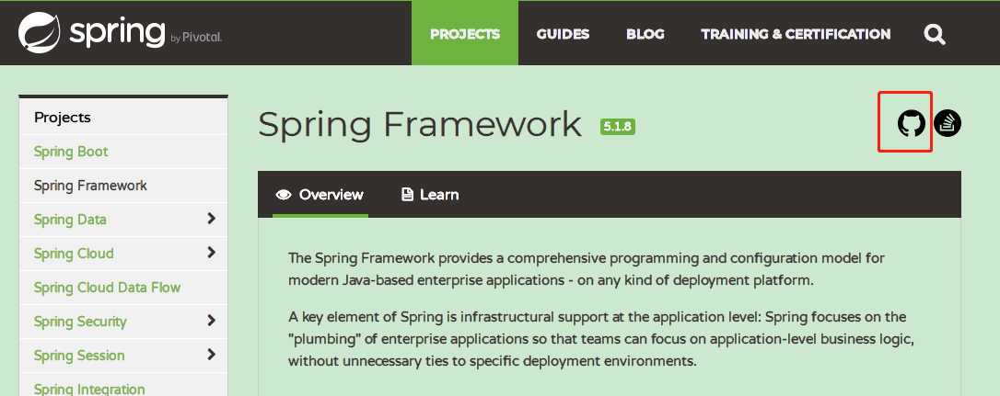
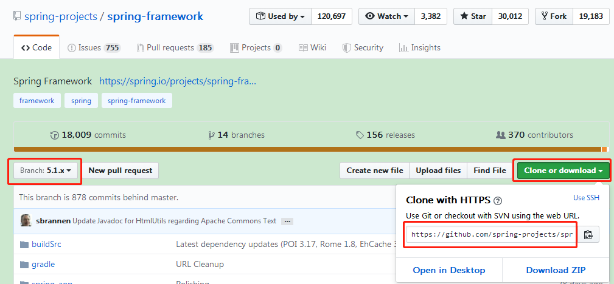
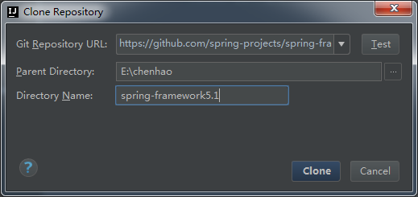
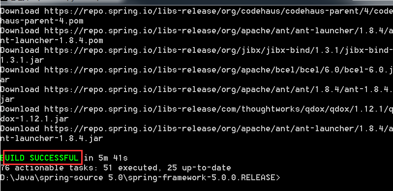
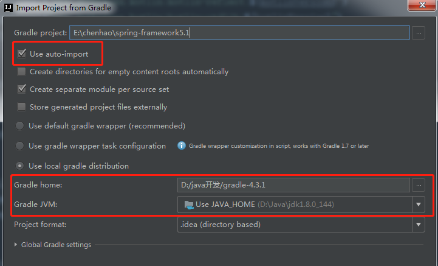
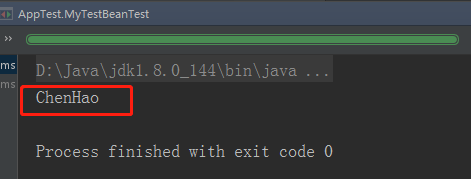

# 整体架构和环境搭建

## 概述

Spring是一个开放源代码的设计层面框架，他解决的是业务逻辑层和其他各层的松耦合问题，因此它将面向接口的编程思想贯穿整个系统应用。
Spring是于2003 年兴起的一个轻量级的Java 开发框架，由Rod Johnson创建。
简单来说，Spring是一个分层的JavaSE/EE full-stack(一站式) 轻量级开源框架。

> 文章整理自[原文地址](https://www.cnblogs.com/java-chen-hao/p/11046190.html)

## 整体架构

Spring框架是一个分层架构，它包含一系列的功能要素，并被分为大约20个模块，如下图所示：


从上图spring framework整体架构图可以看到，这些模块被总结为以下几个部分：

### 1. Core Container

Core Container(核心容器)包含有Core、Beans、Context和Expression Language模块 
Core和Beans模块是框架的基础部分，提供IoC(转控制)和依赖注入特性。这里的基础概念是BeanFactory，它提供对Factory模式的经典实现来消除对程序性单例模式的需要，并真正地允许你从程序逻辑中分离出依赖关系和配置。

Core模块主要包含Spring框架基本的核心工具类
Beans模块是所有应用都要用到的，它包含访问配置文件、创建和管理bean以及进行Inversion of Control/Dependency Injection(Ioc/DI)操作相关的所有类
Context模块构建于Core和Beans模块基础之上，提供了一种类似于JNDI注册器的框架式的对象访问方法。Context模块继承了Beans的特性，为Spring核心提供了大量扩展，添加了对国际化(如资源绑定)、事件传播、资源加载和对Context的透明创建的支持。ApplicationContext接口是Context模块的关键
Expression Language模块提供了一个强大的表达式语言用于在运行时查询和操纵对象，该语言支持设置/获取属性的值，属性的分配，方法的调用，访问数组上下文、容器和索引器、逻辑和算术运算符、命名变量以及从Spring的IoC容器中根据名称检索对象

### 2. Data Access/Integration

JDBC模块提供了一个JDBC抽象层，它可以消除冗长的JDBC编码和解析数据库厂商特有的错误代码，这个模块包含了Spring对JDBC数据访问进行封装的所有类
ORM模块为流行的对象-关系映射API，如JPA、JDO、Hibernate、iBatis等，提供了一个交互层，利用ORM封装包，可以混合使用所有Spring提供的特性进行O/R映射，如前边提到的简单声明性事务管理
OXM模块提供了一个Object/XML映射实现的抽象层，Object/XML映射实现抽象层包括JAXB，Castor，XMLBeans，JiBX和XStream
JMS（java Message Service）模块主要包含了一些制造和消费消息的特性
Transaction模块支持编程和声明式事物管理，这些事务类必须实现特定的接口，并且对所有POJO都适用

### 3. Web

Web上下文模块建立在应用程序上下文模块之上，为基于Web的应用程序提供了上下文，所以Spring框架支持与Jakarta Struts的集成。Web模块还简化了处理多部分请求以及将请求参数绑定到域对象的工作。Web层包含了Web、Web-Servlet、Web-Struts和Web、Porlet模块
Web模块：提供了基础的面向Web的集成特性，例如，多文件上传、使用Servlet 
listeners初始化IoC容器以及一个面向Web的应用上下文，它还包含了Spring远程支持中Web的相关部分
Web-Servlet模块web.servlet.jar：该模块包含Spring的model-view-controller(MVC)实现，Spring的MVC框架使得模型范围内的代码和web forms之间能够清楚地分离开来，并与Spring框架的其他特性基础在一起
Web-Struts模块：该模块提供了对Struts的支持，使得类在Spring应用中能够与一个典型的Struts Web层集成在一起
Web-Porlet模块：提供了用于Portlet环境和Web-Servlet模块的MVC的实现

### 4. AOP

AOP模块提供了一个符合AOP联盟标准的面向切面编程的实现，它让你可以定义例如方法拦截器和切点，从而将逻辑代码分开，降低它们之间的耦合性，利用source-level的元数据功能，还可以将各种行为信息合并到你的代码中 
Spring AOP模块为基于Spring的应用程序中的对象提供了事务管理服务，通过使用Spring AOP，不用依赖EJB组件，就可以将声明性事务管理集成到应用程序中

### 5. Test

Test模块支持使用`Junit`和`TestNG`对Spring组件进行测试

## 环境搭建

### gradle安装

`Gradle`是一个基于JVM的构建工具，是一款通用灵活的构建工具，支持maven， Ivy仓库，支持传递性依赖管理，而不需要远程仓库或者是pom.xml和ivy.xml配置文件，基于Groovy，build脚本使用Groovy编写，需要到gradle官网下载对应版本，[下载地址](http://services.gradle.org/distributions)
windows环境下需要修改系统变量，添加`GRADLE_HOME`系统变量，指向gradle根目录。环境配置成功后，在命令行输入：`gradle -v` 显示如下截图： 


## 源码获取

1. 进入 [官网](https://projects.spring.io/spring-framework/) ，点击那个小猫的图像，进入github下载相应版本的spring源码。



2. 切换为最新的 Spring 5.1. x版 源码 ，获取 Git 分支链接



## 源码下载导入

1. IDEA Spring Git 拉取分支


2. 本地安装目录设置



3. 拉取等待


> 也可以手动直接下载源码到本地

4. 执行gradlew.bat


> 直接双击执行`gradlew.bat`即可。执行完成以后，会出现`build success`的提示，但是这个时候还不算完，为了导入能导入idea中，还需要用`gradlew`命令去编译`spring-oxm`文件包。 

即执行以下命令:

```shell script
gradlew.bat cleanIdea :spring-oxm:compileTestJava 
```

> 完成后，看到如下结果，就离成功不远了。



5. IDEA导入源码



> 此处的gradle使用我们之前自己安装的4.3.1版本，不要用IDE自带的；
> 
> 将jdk版本升级到1.8，因为在最新的Spring中使用到了jdk1.8的新特性，如果不升级到1.8会报错；
> 
> 最后idea会自动编译spring源码，编译成功以后，所有的模块都会有个小小的蓝色图标，表示编译成功，至此spring源码导入完成。

## 可能遇见的问题

`No such property: immutableValues for class: org.gradle.api.internal.tasks.DefaultTaskDependency`

> 修改：spring-beans.gradle

```java
注释掉这两行代码
//def deps = compileGroovy.taskDependencies.immutableValues + compileGroovy.taskDependencies.mutableValues
//compileGroovy.dependsOn = deps - 'compileJava'
```

`Could not find method useJUnitPlatform()`

```text
注释：spring-test.gradle中这行代码
//  useJUnitPlatform {
//    includeEngines 'junit-jupiter'
//    excludeTags 'failing-test-case'
// }
```

## 创建测试项目

1 创建module

> 导入成功之后可以在project下创建一个自己的测试module，项目根目录`右键 -> new -> module -> gradle`


2 添加依赖

> 在新项目的build.gradle下添加对spring模块的依赖，这里我先添加了spring-beans 和spring-core的依赖。

```text
dependencies {
    compile(project(":spring-beans"))
    compile(project(":spring-core"))
    testCompile group: 'junit', name: 'junit', version: '4.12'
}
```

3 添加配置文件

> 在新项目的`src/main/resource`下添加`spring-config.xml`文件

```xml
<?xml version="1.0" encoding="UTF-8"?>
<beans xmlns="http://www.springframework.org/schema/beans"
       xmlns:xsi="http://www.w3.org/2001/XMLSchema-instance"
       xsi:schemaLocation="http://www.springframework.org/schema/beans http://www.springframework.org/schema/beans/spring-beans.xsd">

    <bean id="myTestBean" class="com.chenhao.spring.MyTestBean"/>

</beans>
```

4 测试

> 创建测试bean和启动类

```java
package com.chenhao.spring;

/**
 * @author: ChenHao
 * @Description:
 * @Date: Created in 10:35 2019/6/19
 * @Modified by:
 */
public class MyTestBean {
    private String name = "ChenHao";

    public MyTestBean(String name) {
        this.name = name;
    }

    public MyTestBean() {
    }

    @Override
    public String toString() {
        return "MyTestBean{" +
                "name='" + name + '\'' +
                '}';
    }

    public String getName() {
        return name;
    }

    public void setName(String name) {
        this.name = name;
    }
}
```
```java
import com.chenhao.spring.MyTestBean;
import org.junit.Test;
import org.springframework.beans.factory.BeanFactory;
import org.springframework.beans.factory.xml.XmlBeanFactory;
import org.springframework.core.io.ClassPathResource;

/**
 * @author: ChenHao
 * @Description:
 * @Date: Created in 10:36 2019/6/19
 * @Modified by:
 */
public class AppTest {
    @Test
    public void MyTestBeanTest() {
        BeanFactory bf = new XmlBeanFactory( new ClassPathResource("spring-config.xml"));
        MyTestBean myTestBean = (MyTestBean) bf.getBean("myTestBean");
        System.out.println(myTestBean.getName());
    }
}
```



> 之后就可以愉快的调试spring源码了。
